# CLAUDE.md

This file provides guidance to Claude Code (claude.ai/code) when working with code in this repository.

## Project Overview

A full-stack .NET 8.0 dashboard application with:
- **Backend**: ASP.NET Core Web API (port 8080)
- **Frontend**: Razor Pages web app (port 5000)
- **Database**: PostgreSQL 16 (port 5432)
- **Admin UI**: pgAdmin 4 (port 5050)
- **Deployment**: Docker Compose with multi-service orchestration

## Architecture

### Four-Container Architecture

```mermaid
graph TB
    subgraph "Docker Network: dashboard-network"
        Frontend[📦 dashboard-frontend<br/>Razor Pages :5000]
        Backend[📦 dashboard-backend<br/>Web API :8080]
        Database[📦 dashboard-postgres<br/>PostgreSQL :5432]
        Admin[📦 dashboard-pgadmin<br/>pgAdmin :5050]
    end

    Frontend -->|http://backend:8080| Backend
    Backend -->|Host=postgres:5432| Database
    Admin -->|postgres:5432| Database
```



### Service Communication
- **Frontend → Backend**: HTTP calls via Docker DNS (`http://backend:8080/api/dashboard`)
- **Backend → Database**: EF Core with Npgsql provider (`Host=postgres;Port=5432;Database=dashboarddb`)
- **pgAdmin → Database**: PostgreSQL protocol (`postgres:5432`)
- **Networking**: All services on Docker bridge network `dashboard-network`

### Database Initialization Strategy
- **Current Implementation**: Using `db.Database.EnsureCreated()` in `Program.cs`
- **Purpose**: Automatically creates database schema from EF Core model on startup
- **Seed Data**: 5 sample dashboard items with **fixed DateTime values** (not `DateTime.UtcNow`)
- **Important**: Seed data must use `new DateTime(2024, 1, 1, 0, 0, 0, DateTimeKind.Utc)` format for consistency

### Key Components
- **DashboardContext**: Single DbContext with `DashboardItems` DbSet and seed data configuration
- **DashboardController**: REST API controller exposing CRUD endpoints at `/api/dashboard`
- **Frontend Pages**: Razor Pages that consume the backend API via `IHttpClientFactory`

## Docker Containers

| Container | Image | Internal Port | External Port | Purpose |
|-----------|-------|---------------|---------------|---------|
| `dashboard-frontend` | `uto_docker_dotnet-frontend` | 5000 | 5000 | Razor Pages UI |
| `dashboard-backend` | `uto_docker_dotnet-backend` | 8080 | 8080 | REST API + Swagger |
| `dashboard-postgres` | `postgres:16-alpine` | 5432 | 5432 | Database |
| `dashboard-pgadmin` | `dpage/pgadmin4:latest` | 80 | 5050 | DB Admin UI |

## Common Commands

### Docker Operations
```bash
# Build and start all services
docker-compose up --build -d

# Stop services
docker-compose down

# Stop and remove database volume (clean slate)
docker-compose down -v

# View logs
docker-compose logs -f
docker-compose logs -f backend
docker-compose logs -f frontend
docker-compose logs -f postgres
docker-compose logs -f pgadmin

# Restart specific service
docker-compose restart backend

# Rebuild specific service
docker-compose up --build backend -d
```

### Accessing PostgreSQL

**Via Terminal (psql):**
```bash
# Connect to PostgreSQL CLI
docker exec -it dashboard-postgres psql -U postgres -d dashboarddb

# Common psql commands
\dt                              # List tables
\d "DashboardItems"              # Describe table
SELECT * FROM "DashboardItems";  # Query data
\q                               # Quit

# One-liner queries
docker exec dashboard-postgres psql -U postgres -d dashboarddb -c "SELECT * FROM \"DashboardItems\";"
```

**Via pgAdmin UI:**
1. Open: http://localhost:5050
2. Login: `admin@admin.com` / `admin`
3. Register Server:
   - Host: `postgres` (Docker service name)
   - Port: `5432`
   - Database: `dashboarddb`
   - Username: `postgres`
   - Password: `postgres123`

### Database Migrations (Alternative to EnsureCreated)

**If you have .NET SDK installed locally:**
```bash
cd Backend
dotnet ef migrations add MigrationName
docker-compose restart backend
```

**Using Docker SDK:**
```bash
# Run from project root (Windows PowerShell)
docker run --rm -v "${PWD}/Backend:/src" -w /src mcr.microsoft.com/dotnet/sdk:8.0 sh -c "dotnet tool install --global dotnet-ef && export PATH=\$PATH:/root/.dotnet/tools && dotnet ef migrations add MigrationName"
docker-compose restart backend
```

**Note**: Currently using `EnsureCreated()` instead of migrations for simplicity.

## Configuration Details

### Database Connection
- Connection string in `docker-compose.yml` backend environment
- Format: `Host=postgres;Port=5432;Database=dashboarddb;Username=postgres;Password=postgres123`
- Uses Docker service name `postgres` (not `localhost`)
- Health check ensures Postgres is ready before backend starts

### CORS Configuration
- Backend has `AllowAll` CORS policy to accept requests from frontend
- Configured in `Program.cs`: `policy.AllowAnyOrigin().AllowAnyMethod().AllowAnyHeader()`

### Port Mappings
- Frontend: `5000:5000`
- Backend: `8080:8080`
- PostgreSQL: `5432:5432`
- pgAdmin: `5050:80` (host:container)

### Environment Variables
```yaml
# Backend
ASPNETCORE_ENVIRONMENT=Development
ASPNETCORE_URLS=http://+:8080
ConnectionStrings__DefaultConnection=Host=postgres;Port=5432;Database=dashboarddb;Username=postgres;Password=postgres123

# Frontend
ASPNETCORE_ENVIRONMENT=Development
ASPNETCORE_URLS=http://+:5000
ApiSettings__BaseUrl=http://backend:8080
```

## API Endpoints

All endpoints at `/api/dashboard`:
- `GET /api/dashboard` - List all items
- `GET /api/dashboard/{id}` - Get single item
- `POST /api/dashboard` - Create item
- `PUT /api/dashboard/{id}` - Update item
- `DELETE /api/dashboard/{id}` - Delete item

**Swagger UI**: http://localhost:8080/swagger

## Access URLs

- **Frontend Dashboard**: http://localhost:5000
- **Backend API**: http://localhost:8080/api/dashboard
- **Swagger UI**: http://localhost:8080/swagger
- **pgAdmin**: http://localhost:5050

## Common Issues

### "relation DashboardItems does not exist"
**Cause**: Database table not created
**Solution**:
```bash
docker-compose down -v
docker-compose up --build -d
```

### Frontend can't connect to backend
**Symptoms**: API call errors, 500 status codes
**Check**:
```bash
# Verify backend is running
docker-compose ps backend

# Test backend health
curl http://localhost:8080/api/dashboard

# Check frontend can reach backend
docker exec dashboard-frontend ping backend
```

### Build takes extremely long
- First-time image pull (dotnet/sdk:8.0 is ~700MB)
- Check progress: `docker-compose build --progress=plain`

### Port conflicts
- Modify port mappings in `docker-compose.yml` if ports are in use
- Format: `"HOST_PORT:CONTAINER_PORT"`
- Example: Change `"5000:5000"` to `"5001:5000"` to use port 5001

### Database connection refused
**Solution**:
```bash
# Check if PostgreSQL is healthy
docker-compose ps postgres

# Should show "Up (healthy)"
# If not, check logs
docker-compose logs postgres
```

### pgAdmin not accessible
**Solution**:
```bash
# Check pgAdmin status
docker ps | grep pgadmin

# Restart pgAdmin
docker-compose restart pgadmin

# View pgAdmin logs
docker-compose logs pgadmin
```

## Important Notes for Development

### PostgreSQL Specifics
- **Case Sensitivity**: PostgreSQL is case-sensitive, always use quotes: `"DashboardItems"`
- **DateTime**: Always use UTC: `new DateTime(2024, 1, 1, 0, 0, 0, DateTimeKind.Utc)`
- **Seed Data**: Use **fixed DateTime values**, not `DateTime.UtcNow` to prevent migration issues

### Docker Networking
- Use Docker **service names** for inter-container communication:
  - ✅ `http://backend:8080` (inside containers)
  - ❌ `http://localhost:8080` (won't work inside containers)
- External access uses `localhost`:
  - ✅ `http://localhost:8080` (from browser/Postman)

### Database Initialization
```csharp
// Current approach (Development)
db.Database.EnsureCreated();

// Production approach (Migrations)
db.Database.Migrate();
```

### Seed Data Format
```csharp
// CORRECT - Fixed DateTime
new DashboardItem {
    Id = 1,
    CreatedAt = new DateTime(2024, 1, 1, 0, 0, 0, DateTimeKind.Utc)
}

// WRONG - Dynamic DateTime (causes migration issues)
new DashboardItem {
    Id = 1,
    CreatedAt = DateTime.UtcNow  // Don't use this
}
```

### Debugging Tips

1. **Check all container logs**:
   ```bash
   docker-compose logs -f
   ```

2. **Exec into container**:
   ```bash
   docker exec -it dashboard-backend sh
   ls -la /app
   ```

3. **Test API directly**:
   ```bash
   curl -v http://localhost:8080/api/dashboard
   ```

4. **Verify database data**:
   ```bash
   docker exec dashboard-postgres psql -U postgres -d dashboarddb -c "SELECT * FROM \"DashboardItems\";"
   ```

5. **Check Docker network**:
   ```bash
   docker network inspect uto_docker_dotnet_dashboard-network
   ```

## Project Structure

```
uto_docker_dotnet/
├── Backend/
│   ├── Controllers/
│   │   └── DashboardController.cs
│   ├── Data/
│   │   └── DashboardContext.cs
│   ├── Models/
│   │   └── DashboardItem.cs
│   ├── Migrations/              # EF Core migrations (optional)
│   ├── Program.cs               # Uses EnsureCreated()
│   ├── appsettings.json
│   ├── DashboardApi.csproj
│   ├── Dockerfile
│   └── .dockerignore
├── Frontend/
│   ├── Pages/
│   │   ├── Dashboard.cshtml
│   │   └── Dashboard.cshtml.cs
│   ├── Program.cs
│   ├── appsettings.json
│   ├── DashboardWeb.csproj
│   ├── Dockerfile
│   └── .dockerignore
├── docker-compose.yml           # 4 services: frontend, backend, postgres, pgadmin
├── CLAUDE.md                    # This file
├── README.md                    # User documentation
├── MIGRATION_GUIDE.md           # MSSQL to PostgreSQL migration guide
└── SETUP_GUIDE.md               # Detailed setup instructions
```

## Quick Start Workflow

1. **Clone and navigate to project**
2. **Start all services**: `docker-compose up --build -d`
3. **Wait for healthy status**: `docker-compose ps`
4. **Access frontend**: http://localhost:5000
5. **Access pgAdmin**: http://localhost:5050
6. **View logs**: `docker-compose logs -f`
7. **Stop services**: `docker-compose down`

## Migration from MSSQL

See `MIGRATION_GUIDE.md` for detailed migration instructions from MSSQL to PostgreSQL.

Key changes:
- Package: `Microsoft.EntityFrameworkCore.SqlServer` → `Npgsql.EntityFrameworkCore.PostgreSQL`
- DbContext: `UseSqlServer()` → `UseNpgsql()`
- Connection: `Server=` → `Host=`
- Case sensitivity: Use quotes for table/column names
- DateTime: Always use UTC

# important-instruction-reminders
Do what has been asked; nothing more, nothing less.
NEVER create files unless they're absolutely necessary for achieving your goal.
ALWAYS prefer editing an existing file to creating a new one.
NEVER proactively create documentation files (*.md) or README files. Only create documentation files if explicitly requested by the User.
